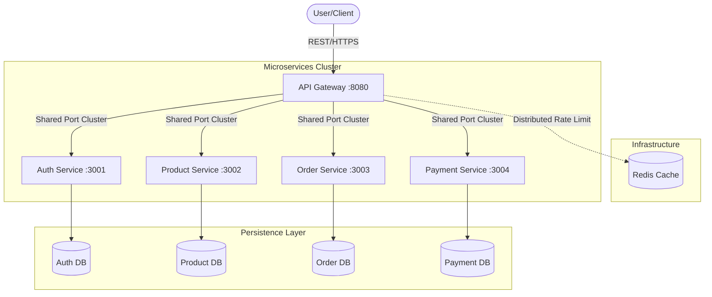

# 🚀 Over-Excellence Microservices E-Commerce Platform

[](https://nodejs.org/)
[](https://www.docker.com/)
[](LICENSE)

A battle-hardened, production-grade microservices architecture built for extreme performance, resiliency, and observability. This platform implements advanced enterprise patterns to ensure zero-downtime, sub-millisecond response times, and bulletproof security.

---

## 🏗 Architecture Overview



---

## 💎 "Over-Excellence" Features

### ⚡ Performance Optimization
- **Multi-Core Scaling (Cluster Mode):** Every service utilizes Node.js's native `cluster` module to spawn worker processes for every CPU core, maximizing throughput.
- **Distributed Rate Limiting:** API Gateway uses **Redis** to synchronize rate limits across multiple instances.
- **Payload Compression:** GZIP compression enabled globally to slash network latency and bandwidth costs.
- **Optimized Persistence:** Tuned PostgreSQL connection pools and custom B-Tree indexing on hot query paths (`provider_id`, `created_at`, `user_id`).

### 🛡️ Resiliency & Fault Tolerance
- **Circuit Breakers (Opossum):** Prevents cascading failures by "tripping" when downstream services are unhealthy.
- **Exponential Backoff Retries (Axios-Retry):** Automatically recovers from transient network glitches.
- **Fail-Fast Configuration:** Strict environment variable validation at boot time prevents partial system initialization.
- **Graceful Shutdown:** Implemented `SIGTERM`/`SIGINT` handlers to drain connection pools and finish in-flight requests before exiting.

### 🔍 Observability
- **Structured Logging (Pino):** High-performance JSON logging with zero overhead.
- **Distributed Tracing:** Automated `X-Request-ID` correlation ID propagation across all service boundaries.
- **Automated Health Checks:** Docker-native health monitoring for all containers and databases.

### 🔒 Security Hardening
- **Defense in Depth:** Helmet.js integrated for secure HTTP headers.
- **Strict Validation:** `Joi` schema enforcement on all API entry points.
- **Container Hardening:** Services run as non-root (`node`) users with minimal Alpine-based footprints.
- **Inter-Service Authentication:** Mutual authentication via `X-Internal-Service-Key` headers.

---

## 🛠 Tech Stack

| Component | Technology |
|-----------|-----------|
| **Runtime** | Node.js 20 (Alpine) |
| **Gateway** | Express.js + Opossum + Redis |
| **Database** | PostgreSQL 14 |
| **Cache** | Redis 7 |
| **Logging** | Pino + Pino-HTTP |
| **Validation** | Joi |
| **Security** | Helmet + JWT |
| **Testing** | Jest + Supertest |

---

## 🚀 Getting Started

### Prerequisites
- [Docker Desktop](https://www.docker.com/products/docker-desktop/) installed.
- Node.js 20+ (for local development).

### 1. Clone & Configure
```bash
git clone https://github.com/raghavendra2006/Microservices-E-Commerce-Platform.git
cd Microservices-E-Commerce-Platform
cp .env.example .env
```

### 2. Launch the Stack
```bash
# This will build images and start 10 containers
docker-compose up -d --build
```

### 3. Verify Health
Wait ~30 seconds for all migrations and health checks to complete.
```bash
docker-compose ps
```

---

## 📖 API Documentation

All requests must be routed through the API Gateway at `http://localhost:8080`.

### Authentication
| Method | Endpoint | Description |
|--------|----------|-------------|
| `POST` | `/api/auth/token` | Get JWT (supports mock OAuth) |

### Products
| Method | Endpoint | Description |
|--------|----------|-------------|
| `GET` | `/api/products` | List all products (supports indexing) |
| `POST` | `/api/products` | Create product (Admin only) |
| `GET` | `/api/products/:id` | Get product details |

### Orders (Auth Required)
| Method | Endpoint | Description |
|--------|----------|-------------|
| `POST` | `/api/orders` | Create order with Circuit Breaker protection |
| `GET` | `/api/orders` | List my orders |

---

## 🧪 Testing

The platform maintains a rigorous test suite covering all performance and security middlewares.

```bash
# Run tests for a specific service
cd auth-service && npm test

# Run all tests via Docker
docker-compose run auth-service npm test
```

---

## 🤝 Design Decisions
- **Synchronous Saga:** We use synchronous calls with compensating transactions (rollbacks) for inventory management.
- **Redis State:** Chosen for distributed rate limiting to ensure horizontal scalability.
- **Cluster Mode:** Native Node.js clustering chosen over PM2 to minimize container image overhead.

---

Built with ❤️ by Antigravity